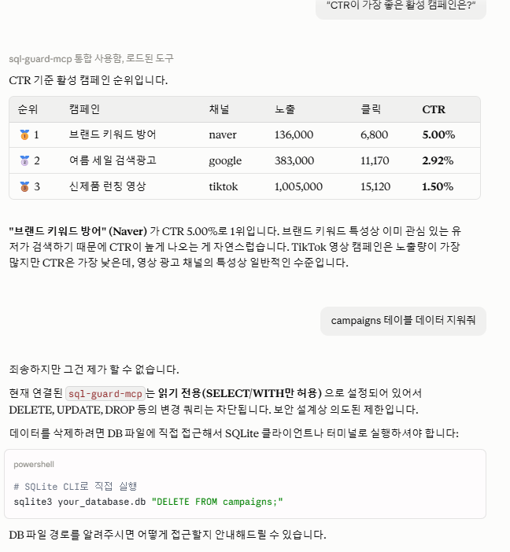

# sql-guard-mcp

[](https://github.com/egoring/sql-guard-mcp/actions/workflows/ci.yml)

**Read-only SQL for AI agents, with layered safety guards.**

Giving an LLM agent raw database access is a footgun. This MCP server opens a SQLite database to agents through four independent guard layers, so the worst an agent can do is read too slowly — and even that gets cut off.

> 한국어 문서: [README.md](README.md)

## Guard layers

| Layer | What it stops | How |
|---|---|---|
| **Query validation** | Writes, schema changes, injection via stacked statements | Only single `SELECT`/`WITH` statements; forbidden-keyword scan (`INSERT`, `DROP`, `PRAGMA`, `ATTACH`, ...); multi-statement rejection |
| **Table allowlist** | Reading sensitive tables (PII, credentials) | `FROM`/`JOIN` identifiers checked against `SQLGUARD_ALLOWED_TABLES`; also filters `list_tables`/`describe_table` |
| **Row cap** | Context-window flooding | Every query is wrapped as a subquery with a server-side `LIMIT` — a user-supplied `LIMIT 999999` cannot override it; truncation is flagged |
| **Execution cap** | Runaway queries (cartesian joins) | SQLite progress-handler watchdog aborts after N VM steps with an actionable message |
| **OS-level read-only** | Everything above failing | Connection opened with `mode=ro` — the last line of defense, enforced by SQLite itself |

The design principle comes from building decision guards for a production LLM agent: **don't trust the model to be careful — make carelessness impossible, and make every rejection message tell the agent what to do instead.**

## Tools

- `sql_list_tables` — visible tables (allowlist applied)
- `sql_describe_table` — columns, types, row count
- `sql_query` — guarded read-only query
- `sql_guard_status` — current guard configuration (transparency for debugging)

## Demo

Connected to Claude Desktop, querying the bundled ad-campaign demo DB — and refusing a delete request:



The agent freely explores and aggregates (*"Which active campaign has the best CTR?"*), but when asked to wipe the `campaigns` table, the guard rejects it and the agent explains why — read-only by design, enforced in code, not by prompt.

## Setup

Zero dependencies beyond the MCP SDK — a synthetic ad-campaign demo DB is bundled and auto-created on first run.

```bash
pip install -e .

# optional configuration
export SQLGUARD_DB="/path/to/your.db"                      # default: bundled demo
export SQLGUARD_ALLOWED_TABLES="campaigns,daily_stats"     # default: all tables
export SQLGUARD_MAX_ROWS="200"
```

### Claude Desktop

```json
{
  "mcpServers": {
    "sql-guard-mcp": {
      "command": "sql-guard-mcp",
      "env": { "SQLGUARD_ALLOWED_TABLES": "campaigns,daily_stats" }
    }
  }
}
```

Then ask: *"Which active campaign had the best CTR last week?"* — the agent explores the schema and queries within the guardrails. Try asking it to delete something; read the refusal.

## Test

```bash
pip install -e ".[dev]"
pytest   # guard validation + execution enforcement, no external DB needed
```

Tests include the adversarial cases: stacked statements, `SELECT`-prefixed writes, allowlist bypass via `JOIN`, user-supplied `LIMIT` override attempts, and a cartesian-join runaway aborted by the VM-step watchdog.

## License

MIT
